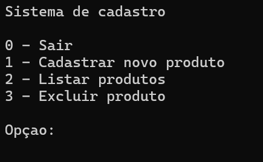

# Sistemadecadastrodeprodutos
Aplicação criada em console com. Net 9. O intuito desse mini software é para treinar conceitos de Poo, desde a criação de classe, método construtor, atributos, modificação dos assessores, métodos até a criação do obejto.

## 📌 Funcionalidades

- Adicionar novos produtos
- Listar produtos cadastrados
- Excluir produtos
- Validação de produtos duplicados pelo nome

## 🛠️ Tecnologias utilizadas

- C#  
- .NET 9
- Console App 

---

## 🚀 Como executar o projeto

- Em breve será criado o executável da aplicação

